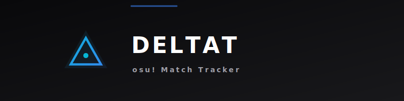
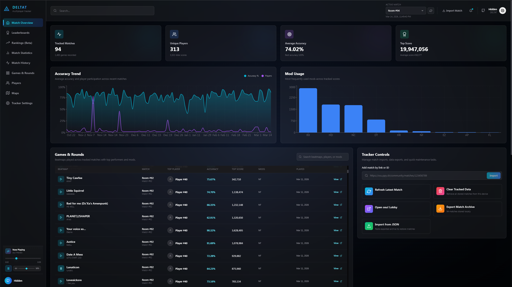
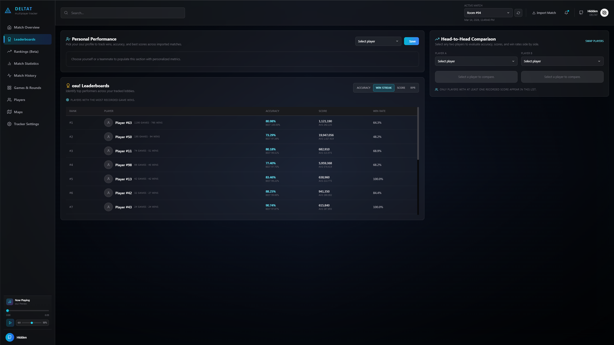
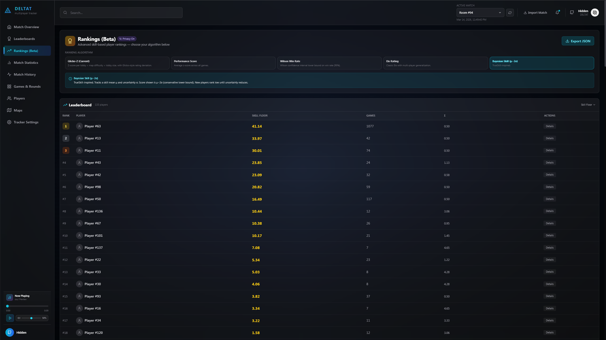
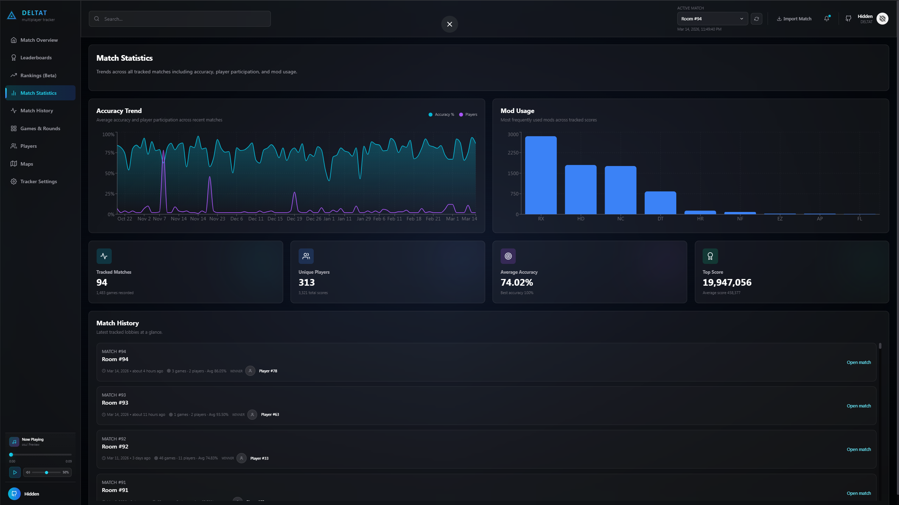
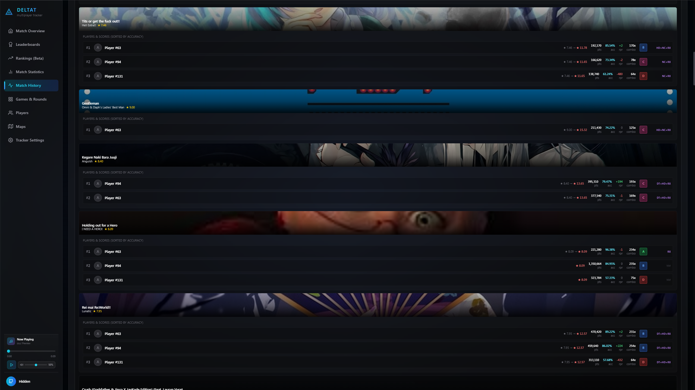
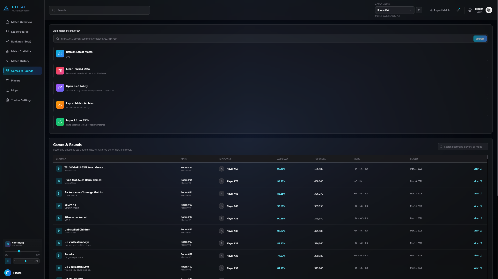
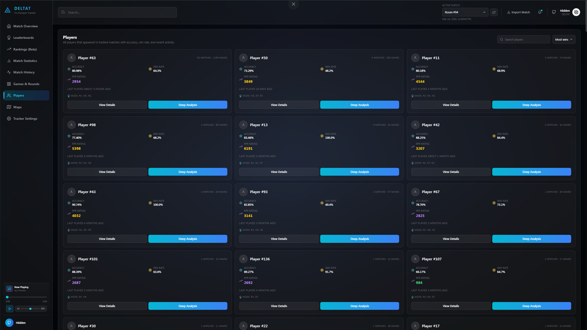
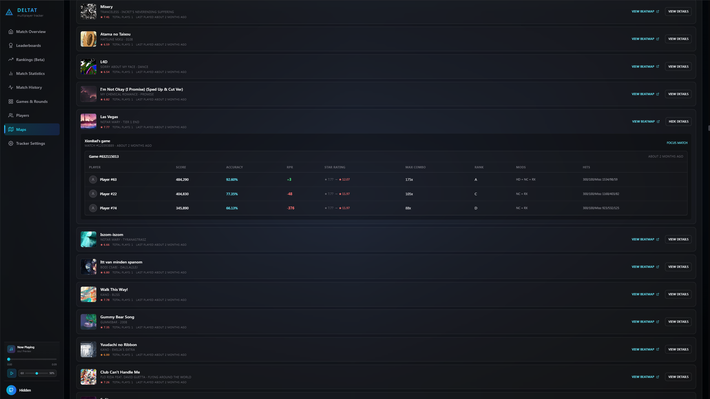
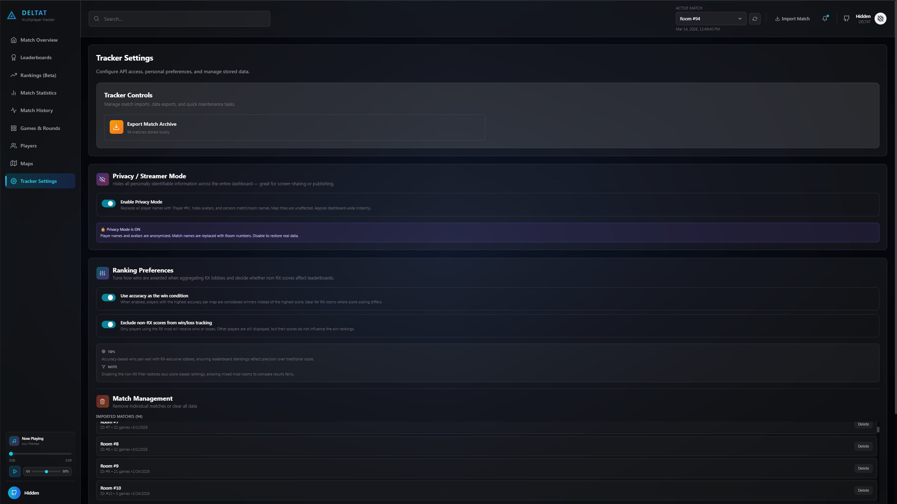

# osu! Match Tracker

<p align="center">
   
</p>

A modern dashboard for tracking osu! (Relax/RX) multiplayer matches, analysing player statistics, and gaining deep insights into match performance.

## Features

- Import matches by pasting an osu! match URL or bare match ID
- Global stats: match count, game count, player count, top accuracy
- Leaderboards: accuracy, wins, score, and Ranked Performance Rating (RPR)
- Five ranking algorithms: Glicko-Z (default), Performance-based, Wilson lower-bound, Multi-player Elo, Bayesian (TrueSkill-inspired)
- Per-player deep analysis and head-to-head comparison
- Analytics charts: accuracy timeline, mod usage, activity heatmap
- Map list with star ratings and mod-adjusted difficulty
- Privacy mode — censors all player names and match IDs for streaming/sharing
- Data export / import as JSON
- Beatmap audio previews
- Settings: dashboard name, ranking algorithm, win condition, privacy mode

## Stack

React 19 · TypeScript · Vite · Tailwind CSS · Recharts · idb (IndexedDB)

## Installation

1. **Clone the repository**
   ```bash
   git clone https://github.com/0xNebi/DeltaT-Osu-Tracker.git
   cd DeltaT-Osu-Tracker
   ```

2. **Install dependencies**
   ```bash
   npm install
   ```

3. **Environment setup**

   Create a `.env` file in the project root with your osu! OAuth2 credentials:
   ```env
   VITE_OSU_CLIENT_ID=your_client_id_here
   VITE_OSU_CLIENT_SECRET=your_client_secret_here
   ```

   You can create a client at <https://osu.ppy.sh/home/account/edit> under **OAuth**. Set the application type to **Public** (no redirect URI needed — this uses the client credentials flow).

4. **Run the development server**
   ```bash
   npm run dev
   ```

   The app starts at `http://localhost:5173`.

   In development, the Vite server exposes a local file-storage endpoint that reads and writes `matches.json` on disk, so match data is shared across browsers and custom dev ports on the same machine.

5. **Build for production**
   ```bash
   npm run build
   ```

## Data storage

In development and preview, the Vite file-storage plugin reads and writes `matches.json` on disk through `/data/matches`, so local match data is shared across browsers on the same machine.

In production or static hosting, the app falls back to the browser's IndexedDB database (`osu-tracker-db`). Nothing is sent to any third-party server beyond direct osu! API requests for match import. The app ships with bundled demo data (`matches.json`) that is seeded on first launch.

To move your data between machines, use the **Export** button in Settings to download a JSON snapshot, then **Import** it on the target machine.

## Project structure

```
src/
├── components/    UI components
├── context/       MatchContext — global state + storage sync
├── hooks/         Thin context wrappers
├── services/      osu! API client, audio player, star-rating cache
├── types/         Shared TypeScript interfaces
└── utils/         Data storage, statistics, ranking algorithms, helpers
```

## Project Preview

- **Match overview**

   <p align="center">
      
   </p>

- **Leaderboards**

   <p align="center">
      
   </p>

- **Rankings**

   <p align="center">
      
   </p>

- **Match statistics**

   <p align="center">
      
   </p>

- **Match history**

   <p align="center">
      
   </p>

- **Games and runs**

   <p align="center">
      
   </p>

- **Players**

   <p align="center">
      
   </p>

- **Maps**

   <p align="center">
      
   </p>

- **Settings**

   <p align="center">
      
   </p>

